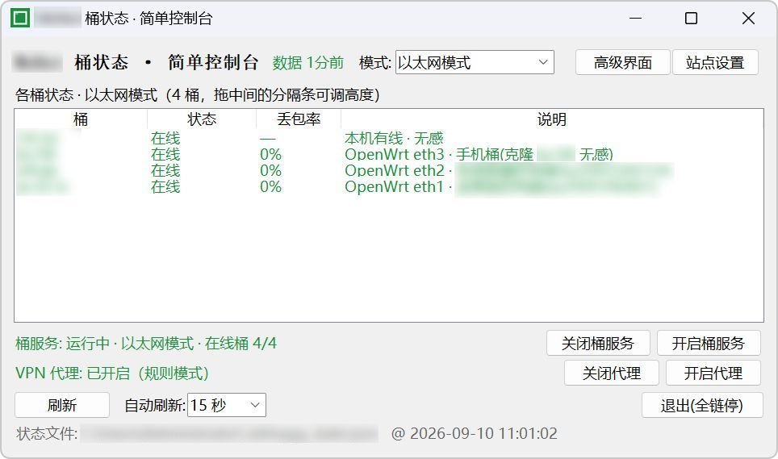
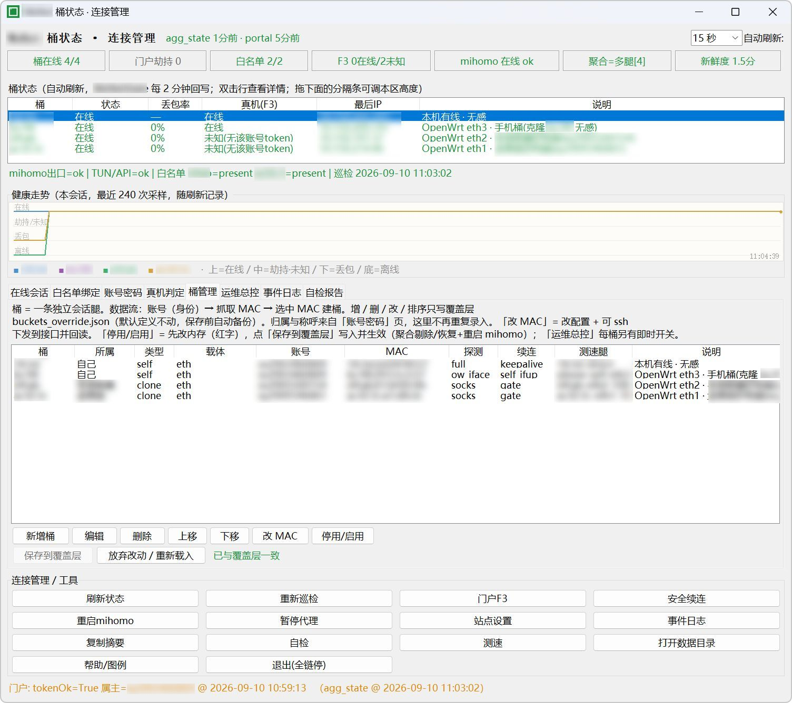

# 校园网多设备带宽合并 · 原理研究（开源归档）

> 校园网「多设备并发会话」带宽合并的技术原理研究归档。
> 本仓库只讲**原理与可复用的通用实现套路**，不与任何真实账号、设备、MAC、厂商实现或校园网内部信息；所有配置模板均以占位符提供。

## 这是什么

很多校园网按「账号 × 设备会话」限速：单台设备只能拿到一份带宽。但认证体系普遍允许同一账号多点在线（无感认证白名单 / 多会话并存），于是可以**让多台设备各自建立独立会话，再在出口侧把多个会话的带宽合并**，获得接近 N 倍单会话上限的等效带宽。

本仓库沉淀了这套思路从「协议观察 → 假设验证 → 工程实现 → 健壮化」的完整过程：

| 文档 | 内容 |
|---|---|
| [docs/01_认证与多会话原理.md](docs/01_认证与多会话原理.md) | 无感认证、设备白名单、多会话并存与下线判定模型 |
| [docs/02_多设备网速合并原理.md](docs/02_多设备网速合并原理.md) | 多会话出口合并：multipath + L4 哈希分流、会话分发、瓶颈分析 |
| [docs/03_限速机制与等效带宽.md](docs/03_限速机制与等效带宽.md) | 单会话限速模型、合并等效带宽的推导与实测方法论 |
| [docs/04_健壮性设计.md](docs/04_健壮性设计.md) | keepalive、断线自愈、白名单巡检、故障模式清单 |
| [templates/](templates/) | 可复用配置模板（全部占位符化） |
| [tools/bucket_console/](tools/bucket_console/) | **多桶聚合控制台**（多桶合一 · 托盘 + 全操控界面）：只读状态 + 调度你自己配置的命令 |
| [experiments/verify_aggregation.md](experiments/verify_aggregation.md) | 聚合是否生效的验证方法与脱敏样例输出 |
| [recipes/single_account_dual_bucket/](recipes/single_account_dual_bucket/) | **配方：单账号双桶**（宽带直连本体 + 同账号第二桶）——只用自己一个账号即可照做的最小配方 |

## 核心结论速览

1. **认证模型**：账号与设备（MAC）绑定，白名单内设备免登录；同一账号可并存多个独立会话——这是合并带宽的**前提**。
2. **会话终结语义**：被动超时 vs 主动解绑（delete 类操作）是两种不同形态，都必须监控——后者会让"无感绑定"静默消失。
3. **带宽上限按会话计量**：N 个独立会话 ≈ N 倍单会话带宽，但实际增益受出口链路、对端能力、哈希碰撞影响。
4. **流量分发用 L4 哈希**（源/目的地址 + 端口），保证 TCP 连接不跨会话乱序；不要用 per-packet 轮询。
5. **健壮性 > 带宽**：会话保活、断线自动补绑、白名单基线巡检缺一不可，否则只是给后续维护挖坑。

## 快速开始

1. 把 `templates/` 中的占位符（`<MAC_A>`、`<网关IP>`、`<接口名>` 等）替换为你的环境。
2. 路由器侧：按 `templates/multipath_setup.sh` 配置多会话 + multipath 出口。
3. 出口侧：按 `templates/host_aggregate.yaml` 配置聚合代理（TUN 模式接管整机流量）。
4. 验证：按 `experiments/verify_aggregation.md` 的方法测速，观察各会话实时速率是否近似叠加、总速率是否逼近 N 倍单会话上限。

> 只想先试最简、只用自己一个账号的"双桶"形态？直接看 **[recipes/single_account_dual_bucket/](recipes/single_account_dual_bucket/)** 配方（宽带直连本体 + 同账号第二桶），有完整可照做的搭建步骤与模板。

## 把多桶管起来：多桶聚合控制台

搭好之后，日常要看状态、要续连、要测速，逐个 SSH 太累。**[tools/bucket_console/](tools/bucket_console/)** 是一个托盘 + 全操控界面的桌面控制台：

- **一眼看桶状态**：总览卡片（在线/劫持/白名单/真机/聚合腿组/数据新鲜度）+ 每桶状态表 + 健康走势图；
- **点按钮做操作**：每桶 204 探测 / 真机判定 / 续连 / 单桶测速，聚合出口重启与代理开关，计划任务启停，一键测速；
- **分流熔断**：按桶采样丢包率，连续超阈值的腿自动隔离、连续达标自动恢复（摘腿/放腿执行你自己配置的命令，
  随附 `leg_ctl.py` 可开箱对接独立节点列表 + provider 热更新）；
- **桶可停用/启用**：临时停掉某条腿不必删配置——停用后不探测、不动作、界面置灰；
- **配置不用手改 JSON**：「配置」按钮打开 schema 驱动的编辑器，保存前校验、自动备份、就地热更新；
- **只读 + 调度**：它不实现任何认证逻辑，所有动作都执行**你自己配置的命令**；环境相关的一切（桶、出口、脚本、账号）都在 `config.private.json` 里；
- **生命周期总开关**：UI 起则拉起服务链，UI 退则全链停，配套任务以心跳文件为门控；
- **自带回归**：`checks/verify_ports.py`（P1–P12 回灌修复）与 `checks/verify_leg_ctl.py`（摘腿/放腿全行为）可重复运行。

```bash
cd tools/bucket_console
cp config.example.json config.private.json   # 填占位符（该命名已被 .gitignore 忽略）
python bucket_console.py --check             # 先自检
python bucket_console.py                     # 再开界面
```

详见 [tools/bucket_console/README.md](tools/bucket_console/README.md)（含与内部测试版一致的 UI 对照表、数据文件约定、分流熔断与腿列表脚本、凭据库与安全边界）。

## 功能演示

> 下列截图来自本项目控制台的实际运行界面。所有可识别标识（品牌名、本机绝对路径、账号、MAC、SSH 地址）均已打码；
> 图中的桶名、接口名、label 与数值均为**演示用示例值**，不对应任何真实环境。演示截图的脱敏要求见 [docs/00_脱敏与贡献规范.md](docs/00_脱敏与贡献规范.md) §4.3。

### 1. 简单控制台：一眼看桶状态



桶状态一目了然：每桶的**在线/离线**、**丢包率**、**说明**，顶部一条状态行给出「桶服务：运行中 · 以太网模式 · 在线桶 4/4」
与 **VPN 代理开关**。不需要 SSH 逐台确认，刷新与自动刷新间隔都在界面上。

### 2. 连接管理（高级界面）：状态 + 运维 + 桶配置



- **顶部总览卡片**：桶在线数、门户劫持数、白名单数、真机判定、聚合出口状态、**数据新鲜度**；
- **健康走势图**：本次会话近 240 次采样滚动记录，用颜色区分「在线 / 中间态 / 离线」；
- **每桶一行**：状态 / 丢包率 / 真机判定 / 最后 IP / 探测方式 / 续连方式 / 测速腿；
- **桶管理**：新增 / 编辑 / 删除 / 上移下移 / 改 MAC / 停用启用，改动先落内存（红字）再「保存到覆盖层」写入生效；
- **连接管理与工具**：刷新状态、重新巡检、门户探测、安全续连、暂停代理、自检、事件日志等一键入口。

### 3. 聚合生效：出口速率叠加


多会话腿同时在线时，出口链路（图中为以太网）的接收速率进入**两百 Mbps 档位**，高于单会话上限——
这就是本方案要拿到的东西。速率的具体判定与验证方法见 [experiments/verify_aggregation.md](experiments/verify_aggregation.md)。

## 环境前提（动手前先自查）

> 本项目**不是**「装上就能用」的通用工具：它依赖你所在网络的认证模型。请先逐条确认，再决定是否投入时间。

### 必须满足

| # | 前提 | 说明 |
|---|---|---|
| 1 | **物理链路：以太网（网线连接）或多网卡** | 推荐以太网。无线场景需要**多张网卡**（或用 5GHz 频段的多条独立链路）才能让各会话真正走不同出口；单张网卡上的多个会话共用同一空口，合并通常无收益甚至更慢 |
| 2 | **账号支持多并发** | 同一账号能同时在多个设备/会话上在线，且各会话**各自独立计量**限速。这是等效带宽叠加的**唯一前提**——若限速按账号总量计，本方案没有意义 |
| 3 | **能确认自己的校园网实际情况** | 认证形态、限速粒度、会话上限、下线判定语义都因学校而异，**必须先实测确认**，不能照抄任何人的结论 |

### 动手前的确认清单

- 认证方式：门户网页认证 / 客户端 / 无感认证（MAC 白名单）分别是什么？**认证报文与下线报文长什么样？**
- 限速粒度：限的是**每会话**、**每设备**、**每账号**还是**整端口**？（用两台设备同时测速即可分辨）
- 并发上限：同一账号最多几个在线？超限时是**踢旧**还是**拒绝新**？
- 会话终结：被动超时多久？是否存在**主动解绑**（delete 类操作）导致白名单静默消失？
- 出口形态：是否跨 NAT / 跨运营商？聚合对端是否在同一自治域内？

### 不适用（别浪费时间）

- 限速按**账号总量**计算——多开会话只会互相抢同一份额度；
- 学校侧**禁止**多设备在线、或在协议里明确禁止共享/多会话；
- 只有**一张无线网卡**且无法用有线——多会话挤在同一空口上，聚合收益极低；
- 校园网本身是**共享带宽池**、无单会话限速——没有可叠加的额度。

> 结论：**先花半小时做上面的确认清单，再决定要不要搭**。确认不了就先看原理文档，不要急着买设备。
> 详细判定方法见 [docs/01_认证与多会话原理.md](docs/01_认证与多会话原理.md) 与 [docs/03_限速机制与等效带宽.md](docs/03_限速机制与等效带宽.md)。

## 建议：用 AI Agent 辅助部署

本项目**推荐用 AI Agent（如 Claude Code / Codex / DSH 等编码 Agent）来辅助部署与排障**，而不是纯手工照抄文档。原因很实在：

- **它是个「多环节 + 强环境相关」的活**：认证行为观察 → 会话分发配置 → multipath / 聚合出口调参 → 保活与巡检 →
  控制台配置，每一步都依赖你的**实际网络行为**，而不是固定答案；
- **控制台本身就是「只读 + 调度你自己配置的命令」**：桶、出口、脚本、账号全部落在 `config.private.json`，
  非常适合交给 Agent 按你的环境生成与迭代；
- **排障是长链路**：探活 000、聚合停掉、白名单消失、限速没叠加……这些故障单看一行日志定位不了，Agent 能并行读代码 + 日志 + 抓包。

### 可以直接丢给 Agent 的提示词

```text
背景：我在研究「校园网多设备并发会话带宽合并」。相关原理文档、配置模板与工具代码都在本仓库。

任务：帮我把这套东西在我自己的环境里搭起来并跑通。

约束：
1. 我的环境信息我会另给（操作系统、网卡数量与名称、路由器型号、认证方式）；
   请**先提问确认**这些信息，不要拿默认值猜。
2. 全程遵守 docs/00_脱敏与贡献规范.md：
   - 不要把真实 MAC / IP / 账号 / 密码 / 订阅信息写进任何**将被提交**的文件；
   - 我本地的真实值只允许出现在 *.private.json 或环境变量里；
   - 每完成一步，跑一遍该文档 §4.1 的自查脚本，并把结果贴给我。
3. 一次只做一步，每步先说明「要改什么、为什么、风险是什么」，等我确认再动手。
4. 每一步都要有**可观测的验证方式**（怎么测、看到什么算成功），不要「改完就说好了」。
5. 遇到需要改路由器 / 改认证行为 / 执行 delete 类操作时，先停下来告诉我影响面。

请从第一步开始：先给我一份按顺序的部署计划（含每步的验证方法），以及你需要我问你哪些环境信息。
```

### Agent 使用注意（强烈建议）

- **别把明文凭据贴进对话**：账号密码走本地文件或环境变量，需要 Agent 读时让它读文件，而不是让你粘贴；
- **提交前必查**：Agent 生成的脚本 / 配置 / 日志很容易夹带真实 MAC、IP、路径——提交前按
  [docs/00_脱敏与贡献规范.md](docs/00_脱敏与贡献规范.md) §4.1 跑一遍自查（PR 清单第 1、5、6 项）；
- **Agent 会自信地编**：凡是关于你校园网认证协议、门户接口、厂商行为的结论，**一律以你自己实测为准**，
  Agent 只能帮你设计实验、读日志、写代码，不能替你确认网络事实；
- **不可逆操作要人确认**：解绑 / 下线 / 改 MAC / 改路由器配置这类动作，务必先确认影响面再放行。

## 免责声明

- 本项目**仅用于技术学习与原理研究**，请只在**你本人拥有使用权 / 已获授权**的账号和设备上实验。
- 请遵守你所在校园网（或其他网络）的用户协议与当地法律法规；绕过付费 / 限速条款的行为由使用者自行负责。
- 本项目不提供接入真实网络的服务；所有示例均为脱敏的通用描述，任何真实环境的复用风险自负。

## 许可

MIT License，见 [LICENSE](LICENSE)。
